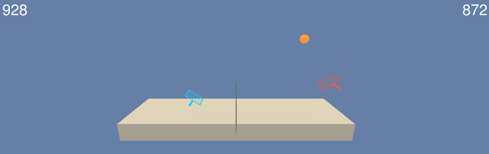
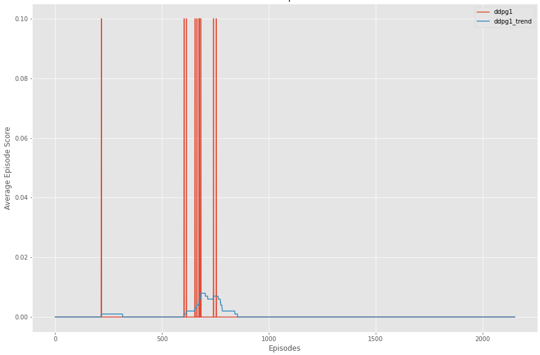
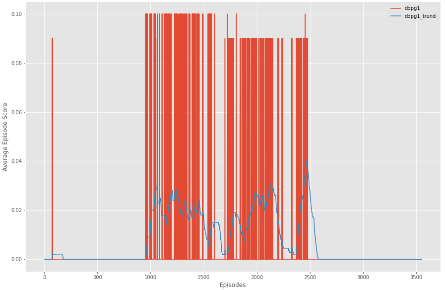
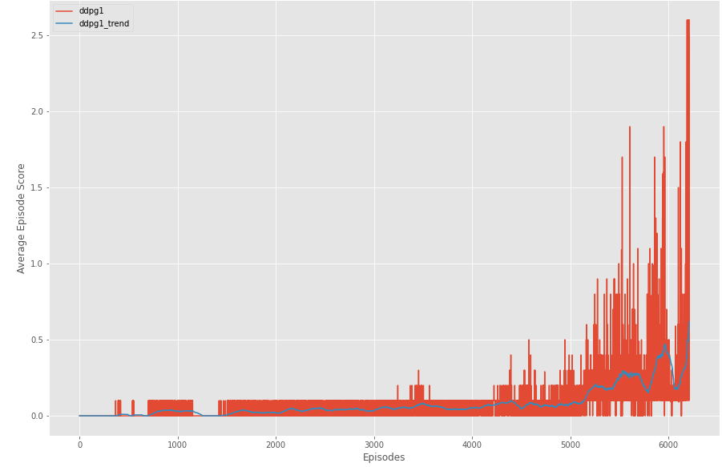
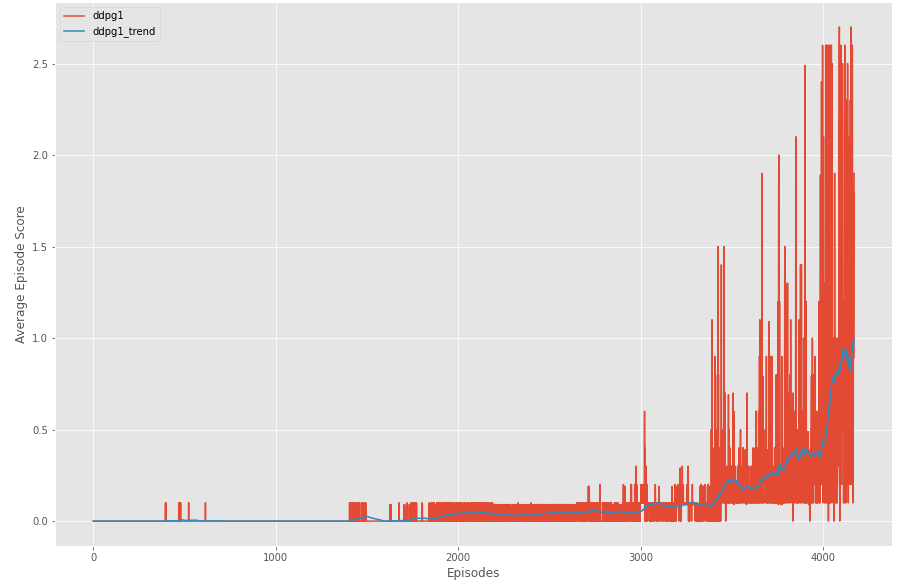

# Introduction

This project was created to use modern methods of continuous control to solve the Tennis problem from AI Gym, which is maintaining a tennis volley using two tennis rackets. In the solution presented here, each racket was controlled by a different agent.

For each agent, the Tennis environment maintains a state of 8 values corresponding to the velocity of the tennis ball used by both agents and the velocity for that agent's tennis racket. Additionally, each agent has an action space of two numbers, with one corresponding to jump height and the second corresponding to horizontal movement. The agent is rewarded a value of 0.1 for hitting the tennis ball over the net and is rewarded -0.01 for letting the ball hit the ground or hitting the ball out of bounds  

The problem was considered solved if an average score of 0.5 could be maintained by either agent over 100 consecutive episodes. The learning algorithm, hyper parameters, and a discussion for future work are presented in the following sections.

# Learning Algorithm

The learning algorithm used for each agent in the project is based on the Deep Deterministic Policy Gradient (DDPG) algorithm presented by Lillicrap et al. (2016) to solve the problem of continuous control of the tennis rackets to hit the ball. The actor for each agent consists of a neural network that determines the action and loss is calculated by the critic. The critic for each agent consists of a neural network that determines the Q-value and loss is determined with the error between Q expected and Q targets. Additionally, both the actor and critic make use of local and target networks as described in Mnih et al (2015), but with a soft update weight of 0.003 and updated once every time step. The final algorithm also made use experience replay buffer to sample during the learning step. However, a shared experience replay buffer was used in the first attempt.

#### Neural Network Architectures

The network architecture used for the actor and the critic were very similar. The network used by the actor had an input layer consisting of 8 nodes, one for each observation in the state and a rectified linear unit (relu) activation function. The next layer was fully connected with 200 nodes and a relu activation function. The third layer was also fully connected, with 100 nodes and a relu activation function. The final layer consisted of 50 nodes and a hyperbolic tangent activation function that output two values, for each action the actor can take.

The network used by the critic is identical to the network used by the agent, with the exception being the output is a number that is the Q-value.

#### Learning Algorithm Procedure

The following pseudo code for the learning algorithm used in this project.

```ps
num_agents = 2

For each agent in num_agents:
	allocate replay buffer
next

For each agent in num_agents:
	initialize local_actor
	initialize target_actor
	initialize local_critic
	initialize target_critic
Next	


While mean(scores) < 1:
	reset environment
	Do Until Done:
		For each agent in num_agents:
			Find action
			Take action against environment with state
			Save next_state, reward, and done
			Add reward to scores
			Add experience to shared replay buffer
			Learn1
	episode_scores.append(max(scores))
```


# Results

Several attempts were made before finding the final solution. The subsections here detail those attempts and provide information regarding the parameters of the learning algorithm used in the attempts.

#### Attempt 1

The first attempt used two agents, one to control each racket. Both agents had identical hyper parameters and placed their experiences in a shared replay buffer.

| Name  | Buffer Size | Batch Size | Gamma | Tau   | Actor LR | Critic LR | Learning Interval   |
| ----- | ----------- | ---------- | ----- | ----- | -------- | --------- | ------------------- |
| ddpg1 | 100000      | 256        | 0.99  | 0.001 | 0.0001   | 0.001     | Once every 10 steps |



The red line is the score during the episode and the blue line is the average of the last 100 episodes. This attempt only resulted in a few occurences of an agent hitting the ball after approximately 2300 episodes.

#### Attempt 2

The second attempt used two agents, one to control each racket, with identical hyper parameters. The difference in this attempt is that each agent had their own experience replay buffer.

| Name  | Buffer Size | Batch Size | Gamma | Tau   | Actor LR | Critic LR | Learning Interval   |
| ----- | ----------- | ---------- | ----- | ----- | -------- | --------- | ------------------- |
| ddpg1 | 100000      | 256        | 0.99  | 0.001 | 0.0001   | 0.001     | Once every 10 steps |



The results were much better than the first attempt, with the agents frequently hitting the ball over the net around episode 1000. However, around episode 2500, the algorithm seems to have crashed and showed no signs of recovery.

#### Attempt 3

The third attempt built on the results of the second. Again, two identical agents were used, each with their own memory buffer. However this attempt increased the learning interval 10x, by updating every step as opposed to every 10.

| Name  | Buffer Size | Batch Size | Gamma | Tau   | Actor LR | Critic LR | Learning Interval    |
| ----- | ----------- | ---------- | ----- | ----- | -------- | --------- | -------------------- |
| ddpg1 | 100000      | 256        | 0.99  | 0.001 | 0.0001   | 0.001     | **Once every step.** |



This attempt was very successful. It took around 4000 episode before the agents started to consistently hit the ball back and fourth in a single episode. It was around this point that the scores started to dramatically increase. After around 6000 episodes, the agents scored an average of 0.6 over 100 episodes and the training was halted. At this point, the problem was solved; however, another attempt was made with a higher threshold to ensure it was not just luck.

#### Final Attempt

The final attempt built upon the results of the third attempt. The buffer size for each agent was doubled and the agents were allowed to train until an average score of 1.0 was achieved.

| Name  | Buffer Size | Batch Size | Gamma | Tau   | Actor LR | Critic LR | Learning Interval |
| ----- | ----------- | ---------- | ----- | ----- | -------- | --------- | ----------------- |
| ddpg1 | 100000      | **512**    | 0.99  | 0.001 | 0.0001   | 0.001     | Once every step.  |



Just like attempt 3, the results were successful. Around episode 3500, there was a dramatic increase in the agents scoring. At episode 4172, the agents had achieved an average score of 1.0, over 100 consecutive episodes; more than double the minimum needed to solve the problem.

# Conclusion

After four attempts, the tennis problem was solved. The weights from the final attempt are saved in the project repository ([weights](./saved_models/ddpg1_weights_final_attempt)) and the training performance was written to a comma separated values (CSV), also saved in the repository ([csv](./reports/data_dump/training_final_attempt.csv)). 

While the current solution solves the problem well and seemed stable, it could surely be improved. The current solution involves two separate agents learning the same thing, that is, hitting the ball over the net. Moreover, the agents benefit from hitting the ball in a cooperative manner that keeps the volley going. The Multi Agent Deep Deterministic Policy Gradient (MADDPG) algorithm, presented by Lowe et al (2017), describes an implementation that would take advantage of this  relationship between the agents. Their MADDPG algorithm is different from the learning algorithm used here in that the critic for each agent has access to the observations and rewards of both agents. For future work, Implementing the MADDPG could yield better learning rates and performance than the current implementation. 


# References

Ryan Lowe, Yi Wu, Aviv Tamar, Jean Harb, Pieter Abbeel, Igor Mordatch. (2017). *Multi-Agent Actor-Critic for Mixed Cooperative-Competitive Environments*. Retrieved from: https://arxiv.org/abs/1706.02275

Volodymyr Mnih, Koray Kavukcuoglu, David Silver, Andrei A. Rusu, Joel Veness, Marc G. Bellemare, Alex Graves, Martin Riedmiller, Andreas K. Fidjeland, Georg Ostrovski, Stig Petersen, Charles Beattie, Amir Sadik , Ioannis Antonoglou, Helen King, Dharshan Kumaran, Daan Wierstra, Shane Legg & Demis Hassabis. (2015). *Human-level control Through Deep Reinforcement Learning*. Nature 518. https://www.nature.com/articles/nature14236

Timothy P. Lillicrap, Jonathan J. Hunt, Alexander Pritzel, Nicolas Heess, Tom Erez, Yuval Tassa, David Silver, Daan Wierstra. (2016).  Continuous control with deep reinforcement learning. https://arxiv.org/abs/1509.02971


